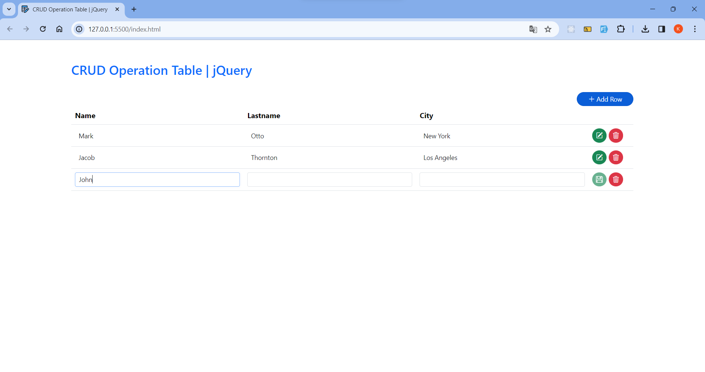

# <h1 align="center">jQuery - CRUD Operation Table ✏️</h1> 

<p align="center">A simple table where crud operations are performed with jQuery.</p>



## 💎 Features

<ul>
  <li>➕ Add row - Columns in the row are added dynamically as many as the number of headings in the table</li>
  <li>✏️ Edit row - Inline</li>
  <li>🗑 Delete row</li>
  <li>📌 When input values are empty, the save button is disabled</li>
</ul>

## 📋 Instruction

Clone this repository.

```shell
git clone https://github.com/kaderbrl/crud-operation-table-jQuery.git
```

## 💻 Live Demo

Check the live demo here 👉 [Demo](https://kaderbrl.github.io/crud-operation-table-jQuery/) 

## Languages and Tools

<div align="left">
  
  
  
  
  
</div>
